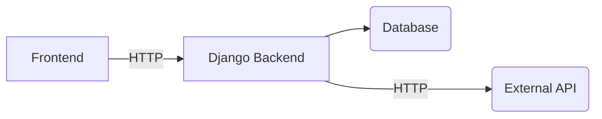

# Solar Grade Mid Level Test

> Before start coding, read carefully all this document.

## General Information

As a industrial product, we have the need to integrate our product with multiple external providers. In this excercise you will need to contact multiple rest services, process the data, and serve it over a REST API with Django REST Framework.

## Problem to solve
Our client **FakeSolar Co, wants to integrate his system into ours**. As an O&M company, FakeSolar has inspections and inspectors. This data needs to be displayed in our product likewise it were present in our database, but the reallity is we'll be recovering the data from FakeSolar's REST API.

### FakeSolar API Specifications
The API that FakeSolar provided us is splited in two endpoints. One will return the **inspections** and the other one the **inspectors**.

FakeSolar had integrations with multiple softwares, but they don't want that all the inspections will be displayed on all the integrations. We decided with them to manage the visualization of the inspector/inspections as next:

- They will provide all the inspections available in FakeSolar system in the inspections endpoint
- In the inspectors endpoint, they added a field called "availableIntegrations". That field contains a list with the integrations where the data of that inspector should be displayed. They assigned us the code "SolarGrade".
- We should only display the inspections from the inspectors that are available to "SolarGrade".

#### Inspections Endpoint

> https://6244305b3da3ac772b0c7854.mockapi.io/fakeSolar/3rdParty/inspections

    [
      {
        "createdAt": "2022-03-31T15:21:57.972Z",
        "city": "Valencia",
        "scheduledDate": "2022-03-31T15:21:57.972Z",
        "inspectorId": 37,
        "id": "1",
        "items": [
          {
            "createdAt": "2022-03-31T20:00:57.663Z",
            "isIssue": false,
            "severity": 91,
            "label": "lorem ipsum",
            "position": [
              "57.9456",
              "-120.0962"
            ],
            "id": "1",
            "inspectionId": "1"
          }
	    ]
	  }
    ]

#### Inspectors Endpoint

> https://6244305b3da3ac772b0c7854.mockapi.io/fakeSolar/3rdParty/inspectors

    [
      {
        "createdAt": "2022-04-01T01:49:39.325Z",
        "name": "Alicia Adams",
        "availableIntegrations": [
          "SolarGrade"
        ],
        "id": "1"
      }
    ]

### SolarGrade Endpoint to develop
#### Route
> /api/solargrade/inpsections?company={company}
#### Returned model / dto
| Type | VariableName | Data Mapping from external API |
|--|--|--|
| String | title | `"${City} - ${InspectionYear}/${InspectionMonth}/${InspectionDay}"` |
| String | inspectorName | The name of the inspector who did the inspection |
| Integer | itemsOk | Items that had the isIssue flag setted as false |
| Integer | issuesWarningCount | Items that are issues and had a severity < 60 |
| Integer | issuesCriticalCount | Items that are issues and had a severity >= 60 |
| String | Company | Company that did the inspection

### SolarGrade Frontend

- The frontend must use Angular.
- You can use how many components as you consider
- You can assume that the baseUrl of the API is constant (localhost:port) so you don't need to add configurations for this.
- You can assume that the main component you are building is always requesting the data for "FakeSolar" organization.
- You can use any library you want.
- You don't need to add routing, you can use the main component as entry point.

### Acceptance criteria
- The endpoint returns the desired model
- The endpoint will return the data from the external system only if we are filtering data of FakeSolar. Otherwise we'll return data from the DB and filter by the "Company" value.
	- You'll need to add the model to the ORM and add a valid migration. Is not needed to populate the database with data.
- The data is dislayed in a table
- If the inspection is in warning state, the row in the table will be displayed yellow; if it's in critial state will be displayed red. If a inspection has critical issues, his status will be critical. If not, but have warning ones, will be warning.
- In the top of the table, will be a small dashboard with the total inspections and issues of each type of issue/inspection.
- You added all the pip requirements to a requirements.txt file (if you don't know how to doit, you can list all the pip packages that will be required to install in order to have the backend running)
- The data mapping requirements are fulfilled.

### Will be great...
- If you add unit tests for any business logic you will consider interesting to test.

### You can...
- Use google. This is a real-work-like test, we are not the college.
- Use any external libraries you desire. That includes backend, frontend, css, http libs... Anything you think will be helpfull.

### Things we will evaluate
- Your ability to write clean and understable code.
- Your experience working with Python / Django REST Framework.
- Your capabilities to work with modern frontend frameworks as Angular.

### Things we will NOT evaluate
- Your frontend designing skills
